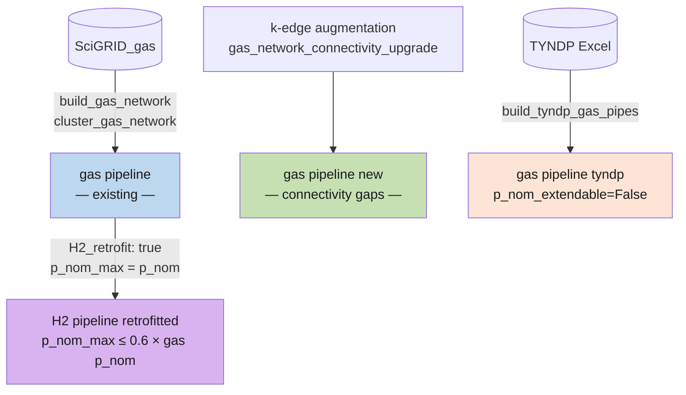

# Gas Network

## Overview

The gas network is a **standard PyPSA-Eur feature**. The existing European
transmission infrastructure is reconstructed from two open datasets and added
to the model as PyPSA `Link` components. This page describes how that base
infrastructure is represented, followed by the two modifications made in this
project relative to base PyPSA-Eur:

1. **Russian gas imports are removed** in all scenarios by default
2. **TYNDP gas pipeline projects** are processed and added to the model

---

## Existing Infrastructure (PyPSA-Eur)

### Data sources

| Dataset | What it provides |
|---|---|
| **SciGRID_gas** ([scigrid.de](https://www.gas.scigrid.de/)) | European pipe geometry, diameter, pressure, bidirectionality, underground storage locations |
| **GEM** (Global Energy Monitor) | LNG terminal locations and capacities, onshore production sites |

### Build pipeline

Three Snakemake rules prepare the existing network before it reaches
`prepare_sector_network`:

1. **`build_gas_network`** (`scripts/build_gas_network.py`) — loads the
   SciGRID_gas GeoJSON (`IGGIELGN_PipeSegments.geojson`); infers pipe capacity
   from diameter using the piecewise-linear formula from the
   [European Hydrogen Backbone report](https://gasforclimate2050.eu/wp-content/uploads/2020/07/2020_European-Hydrogen-Backbone_Report.pdf)
   (e.g. 500 mm → ~1.5 GW, 900 mm → ~11.25 GW); corrects outlier capacities
   and lengths; flags short pipes (<10 km) as bidirectional.

2. **`cluster_gas_network`** (`scripts/cluster_gas_network.py`) — spatially
   joins both pipe endpoints to model bus regions; recalculates length as
   haversine × 1.25 (routing factor); drops intra-region pipes; aggregates
   parallel pipes on the same corridor by summing `p_nom`.

3. **`build_gas_input_locations`** (`scripts/build_gas_input_locations.py`) —
   assembles per-node supply capacity tables for LNG terminals, cross-border
   pipeline entry points, onshore production, and underground storage.

When `H2_retrofit: true`, gas pipes become candidates for conversion to
hydrogen transport — their capital cost is reduced to a small decommissioning
penalty and capacity is freed for `"H2 pipeline retrofitted"` links on the
same corridors.

---

## Russian Import Removal

**Rule:** `build_gas_input_locations`
**Script:** `scripts/build_gas_input_locations.py`

The base config sets `import_from_russia: false` under `sector:`, so Russian
pipeline entry points are excluded in all scenarios. If re-enabled but
`nordstream` is disabled, only the Nord Stream pipeline is excluded:

```python title="scripts/build_gas_input_locations.py"
if not snakemake.params.import_from_russia:
    entry = entry.loc[~(entry.from_country == "RU")]
elif not snakemake.params.nordstream:
    entry = entry.loc[entry.id != "INET_BP_63"]
```

---

## TYNDP Gas Pipelines

**Rule:** `build_tyndp_gas_pipes`  
**Script:** `scripts/build_tyndp_gas_pipes.py`  
**Input file:** `data/gas_network/TYNDP_Gas_Interconnectors.xlsx`

### Input data format

The Excel file contains the following columns (rows with any missing value in these columns are dropped):

| Column | Type | Description |
|---|---|---|
| `Code` | string | Unique project identifier (e.g. `TRA-N-7`) |
| `Project Name` | string | Human-readable project name; combined with `Code` into a `tag` field |
| `Maturity Status` | string | One of `FID`, `Advanced`, `Less-Advanced` — used for scenario-dependent filtering |
| `Diameter (mm)` | float | Pipe inner diameter; converted to capacity via the same piecewise-linear formula used for existing SciGRID_gas pipes |
| `Length (km)` | float | Pipeline length in km |
| `PCI 5th List` | string | `Yes` or `No` — whether the project is on the EU Projects of Common Interest (PCI) 5th list |
| `Project Commissioning Year Last` | int | Latest commissioning year; determines which planning horizon the pipe is built in |
| `Start` | string | Start location — either a 2-letter country code (e.g. `DE`) for countries with a single cluster, or DMS coordinates (e.g. `51°30'N 000°07'E`) for countries with multiple clusters |
| `End` | string | End location — same format as `Start` |

Additional columns present in the file (`Project Description`, `Capacities`, `Reference`) are read but dropped before output.

!!! tip "Adding a new project"
    Copy an existing row, assign a new `Code`, fill in all required columns, and set `Maturity Status` to the appropriate level. The script will automatically:

    - convert `Diameter (mm)` to MW capacity
    - resolve 2-letter country codes or DMS coordinates to model cluster names
    - drop the project if both endpoints fall within the same cluster

TYNDP gas pipeline project data is processed and mapped to model cluster
regions using geographic coordinates:

```python title="scripts/build_tyndp_gas_pipes.py"
# Load TYNDP project list
tyndp_raw_data = pd.read_excel(snakemake.input.tyndp_gas_projects)

# Remove projects with missing critical data
tyndp_raw_data.dropna(subset=[
    'Code', 'Project Name', 'Maturity Status', 'Diameter (mm)',
    'Length (km)', 'PCI 5th List', 'Project Commissioning Year Last',
    'Start', 'End'
], inplace=True)

# Convert DMS coordinates to cluster names
def coordinates_to_cluster(coordinates):
    ...
    point = Point(dd_lon, dd_lat)
    return regions.loc[regions['geometry'].contains(point), 'name'].values[0]
```

Pipe capacity is derived from diameter using the `diameter_to_capacity`
function (from `build_gas_network.py`). Projects entirely within one cluster
are dropped. The output is saved to CSV for use in `prepare_sector_network`.

### Scenario-Dependent Project Selection

TYNDP projects are filtered by maturity status via the scenario config:

| Scenario | `allowed_statuses` |
|---|---|
| CE, CN | `FID` only |
| SE, SN | `FID`, `Advanced`, `Less-Advanced` (default — no override in scenario config) |

```yaml title="config/scenarios/config.CE.yaml"
policy_plans:
  include_tyndp_gas:
    enable: true
    allowed_statuses:
      - FID  # Final Investment Decision
```

---

## Pipeline Extendability



!!! info "PyPSA capacity parameters"
    - **`p_nom`** — the nominal (installed) capacity of a link in MW. For existing pipes this equals the current physical capacity read from the dataset.
    - **`p_nom_extendable`** — if `True`, the optimizer may change the capacity; if `False`, the capacity is fixed at `p_nom` and no investment decision is made.
    - **`p_nom_min`** / **`p_nom_max`** — bounds on the capacity the optimizer can choose. `p_nom_max = p_nom` means the pipe can never grow beyond its current size; `p_nom_min = 0` means it can shrink all the way to zero (i.e. be decommissioned).

| Type | Carrier | Source | `p_nom_extendable` |
|---|---|---|---|
| Existing pipes | `gas pipeline` | SciGRID_gas (clustered) | Depends on `H2_retrofit` and `wasserstoff_kernnetz.optimize_after` — see below |
| New connectivity pipes | `gas pipeline new` | k-edge augmentation | Always `True` — controlled by `include_tyndp_gas.optimize_after` |
| TYNDP projects | `gas pipeline tyndp` | TYNDP Excel file | Always `False` — fixed at commissioned capacity |

### Existing pipes (`gas pipeline`)

Behaviour depends on whether `H2_retrofit` is enabled:

- **`H2_retrofit: true`** (default): Existing pipes get a small decommissioning capital cost
  (`0.1 €/MW/km/a`), `p_nom_max = p_nom` and `p_nom_min = 0`. The pipe capacity is therefore
  **capped at its current value** — it can never grow. Instead the optimizer can *reduce* it
  toward zero, freeing that capacity for `H2 pipeline retrofitted` links on the same corridors.
  Two separate mechanisms reduce gas pipe capacity:
    1. **Exogenous reduction** (`scripts/modify_prenetwork.py`): when `wasserstoff_kernnetz`
       is enabled, gas pipe `p_nom` is directly reduced by the `removed_gas_cap` of all
       Wasserstoffkernnetz (hydrogen core network) pipes commissioned up to the current
       horizon — this happens unconditionally, before any optimization.
    2. **Optimizer reduction** (`scripts/prepare_sector_network.py`): whether the optimizer
       can *additionally* reduce gas capacity is controlled by `wasserstoff_kernnetz.optimize_after`
       via `p_nom_extendable` — fixed until that year, freely reducible after.
  The same `optimize_after` parameter also gates all **H2 pipeline** extendability
  (carriers containing `"H2 pipeline"`) in `scripts/modify_prenetwork.py`.
- **`H2_retrofit: false`**: Pipes are fully extendable with no upper bound (`p_nom_max = inf`,
  `p_nom_min = p_nom`, full capital cost charged) — capacity can grow freely.

### New connectivity pipes (`gas pipeline new`)

Added via k-edge augmentation to ensure `gas_network_connectivity_upgrade`-connectivity of the
gas bus graph. Always extendable. Whether they are added at all is controlled by
`include_tyndp_gas.optimize_after`: set to `false` to suppress them entirely, `true` (default)
to always add them. An integer value has no practical gating effect due to how the logic is
implemented — only `false` prevents new pipes from being added.

### TYNDP gas projects (`gas pipeline tyndp`)

Commissioned at fixed capacity (`p_nom_extendable=False`) in the planning horizon their
commissioning year falls into. The `optimize_after` key in the config has **no effect** on
these — it controls new connectivity pipes only.

!!! note "No `optimize_after` for gas"
    Unlike TYNDP electricity projects and national grid plans, TYNDP gas pipelines are
    always added as **fixed capacity** (`p_nom_extendable=False`). The `optimize_after`
    key exists in the config but has no effect — commissioned projects are simply built
    in the horizon they fall into and cannot be further optimized.

---

## How to Modify the Gas Network

### Change which TYNDP projects are included

Set `allowed_statuses` in the scenario config file.
To allow all maturity levels, omit the key entirely:

```yaml title="config/scenarios/config.CE.yaml"
policy_plans:
  include_tyndp_gas:
    enable: true
    allowed_statuses:
      - FID
      - Advanced
      - Less Advanced
```

### Control Russian import handling

Override the parameter in the scenario config:

```yaml
sector:
  import_from_russia: false  # set to true to allow Russian pipeline gas
  nordstream: false          # set to true to include Nord Stream specifically
```

To add custom gas pipeline projects, extend the TYNDP Excel input file
(`data/gas_network/TYNDP_Gas_Interconnectors.xlsx`) — see the
[Input data format](#input-data-format) table above for the required columns.
